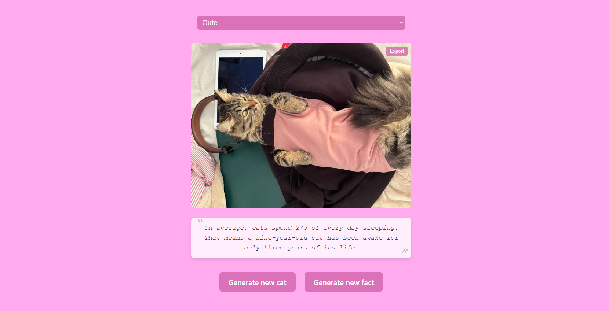

# Cat Generator

### About: 
This project is a web application that displays random cat images and facts. Users can select different tags to view various cat images, generate new cat facts, and export the displayed content as a PDF. Both the cat images and facts are fetched from the server via API requests.

### Demo:

### Technologies Used:

### Packages Used:

-   [jsPDF-html2canvas](https://www.npmjs.com/package/jspdf-html2canvas)
-   [axios](https://www.npmjs.com/package/axios)

### Other Links:

-   [photo / tags of cats](https://cataas.com/)
-   [facts of cats](https://catfact.ninja/)
